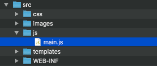

# Adding Custom JavaScript to a Theme

[$LIFERAY_LEARN_YOUTUBE_URL$]=https://www.youtube.com/embed/4CoRInj6SeA

Beyond simple styling, pages across a platform often need to have JavaScript functions and components added to create a great user experience. Developers may need to add both global JavaScript as well as specific JavaScript components or applications. The Theme is the context in which global JavaScript can be added for each site page.


## JavaScript on the Livingstone Platform

Kaito needs to create a custom sign-in modal and add some JavaScript to the top search for every page on the different Livingstone Hotels & Resorts sites. He will do this by implementing JavaScript in a theme similar to how he added custom CSS. For the remaining JavaScript needs, he can use the Bundle Generator to create JavaScript modules.

## Global JavaScript

Just like the HTML and CSS, the theme also controls the JavaScript that gets loaded for every single site page when the theme is applied. If there are functions that need to be defined or functions that should be available globally, they should be added to the theme.

```{important}
Key Point: <br>
To add custom global JavaScript to a theme, include it in the `main.js` file in the theme src.
```



The base `main.js` file has three callbacks that can be used for different functions:
* **AUI().ready(fn)**: is executed after the HTML in the page finishes loading (minus loading any portlets via AJAX)
* **Liferay.Portlet.ready(fn)**: is executed for each of a page’s portlets, after each portlet loads. This callback receives two parameters:
	* _portletId_: the current portlet's id
	* _node_: the Alloy Node object of the current portlet
* **Liferay.on(fn)**: is executed after everything else (including AJAX portlets) finishes loading

If a developer wanted to add a button next to the password field that users could click to show their password when typing, they could add their code to one of these callbacks. 

Here is what it would look like to write the above example within the `AUI().ready` callback using basic JavaScript:
```javaScript
AUI().ready(
	`liferay-sign-in-modal`,
	function(A) {
		/* this is the password input field */
		var password = target.previousElementSibling;

		( 'password' == password.getAttribute('type') ) ? 
		password.setAttribute('type', 'text') : password.
		setAttribute('type', 'password');

		target.textContent = ( 'Hide' == target.textContent ) ? 'Show' : 'Hide';

		putCursorAtEnd(password);
	}
);
```

This is used to make the password visible `(type, text)` and hidden `(type, password)` at the press of a button when combined with the FreeMarker and CSS defined in a theme. 

## Using Third-Party JavaScript

Developers can also take advantage of the other JavaScript libraries included in Liferay. 

```{important}
Key Point: <br>
Liferay DXP 7.2 is compatible with additional JavaScript frameworks out-of-the-box, including:
<ul>
	<li><b>Metal.js</b> (developed by Liferay)</li>  
	<li><b>jQuery</b> (included with Liferay)</li>  
</ul>
```

> Note: Lodash was included in Liferay DXP 7.1 out-of-the-box, but is no longer included in 7.2. If you want to use Lodash in Liferay DXP 7.2, you can go to _Control Panel_ → _Configuration_ → _System Settings_ → _Third Party_ and set Lodash to `true`.

Developers can take advantage of the ECMAScript features with Metal.js by adding a separate `es.js` file with the ECMAScript code and include it in the `main.js` file. Similar to partials in SCSS, this better organizes the JavaScript and makes for simpler customization in the future. 

Let's say the developers wanted to add some JavaScript to the top search widget to make it more visually appealing when a user searches for content. They can create a `top_search.es.js` file in their theme's `js` folder. This file would need to import the metal dependencies necessary:

```JavaScript
import async from 'metal/src/async/async';
import core from 'metal/src/core';
import dom from 'metal-dom/src/dom';
import State from 'metal-state/src/State';
```
Then they can add their custom ECMAScript code. From here, they need to make sure their new code is read by adding a require statement in the `main.js` to run the function:
```JavaScript
require(
		'custom-theme/js/top_search.es',
		function(TopSearch) {
			new TopSearch.default();
		}
	);
```
Finally, to get all of this to read, developers can take advantage of NPM to install the dependencies needed. For this particular example, developers would need the ES2015 hook and metal, metal-dom, and metal-state dependencies, since they're explicitly imported in the `top_search.es.js` file. 

> Note: For information on creating a custom gulp hook to add the ability to compile code from external frameworks to your build process, you can check out the following post: [https://web.liferay.com/web/alexander.valencia/blog/-/blogs/adding-flexibility-to-your-themes-through-gulp-hooks](https://web.liferay.com/web/alexander.valencia/blog/-/blogs/adding-flexibility-to-your-themes-through-gulp-hooks)

With these options, developers can add the global JavaScript they need to accomplish their goals.

## Knowledge Check
Global JavaScript that will be executed on every page can be added to ____________________.
* The main.js file is the primary JavaScript file packaged in a ____________________.
* Metal.js and jQuery are included by default with Liferay, but any front-end ____________________ can be used when writing your JavaScript.
* JavaScript can be organized in a more ____________________ way by requiring other JS files in the main.js.

---

## Next Up

* [Exercise 2: Modify the Styling of Themes](./exercise-2-modify-styling-of-themes.md)

## Previous Step

* [Exercise 3: Add Custom JavaScript to a Theme](./exercise-3-add-custom-javascript-to-theme.md)