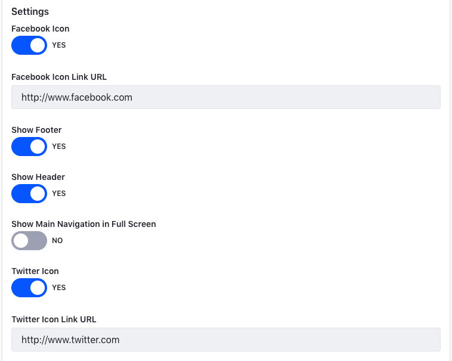
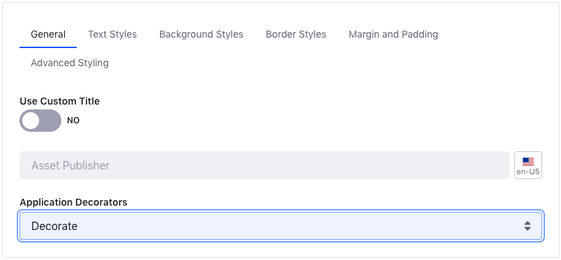

# Configuring the Theme

[$LIFERAY_LEARN_YOUTUBE_URL$]=https://www.youtube.com/embed/94g7-qltrT8

When managing multiple sites, flexibility in fulfilling the particular requirements that are necessary to crafting a tailored user experience is important. The web-team responsible for the creation and management of sites will often need the ability to add, move, or remove different UI elements added in the theme. For example, if the web-team wanted to use the same basic theme elements on an intranet site without footer icon links to social media, they'll need options to remove those. With a Liferay Theme, developers can create configuration settings that bridge the gap between the developer team and the web-team to meet these needs.

## Livingstone's Theme Configuration

Kaito and Martin are responsible for the design and implementation of the Livingstone Hotels & Resorts brand as a whole and Josiah Copeland, the Platform Administrator, will be the one responsible for leading the effort to set up each of Livingstone Hotels & Resorts's sites. As of right now, if Kaito were to deploy the theme to production, the theme would be HTML, CSS, and JavaScript complete. But Josiah needs to update certain aspects of the page, layout, and widgets.  Kaito can configure the theme to include a number of configurable settings as well as layouts.

## Theme Settings and Packages

Configurable settings allow administrators to do things like configure the site to display the theme, configure how content is being displayed, and modify aspects of the page without having to modify and redeploy the theme itself.

```{important}
Key Point <br>
<li>A Theme can be configured to include the following settings and packages:</li>
  <ul>
      <li><b>Theme Settings:</b> Hard-coded or configurable values in the Theme that can give administrators functional control over different stylistic elements of a site</li>
      <li><b>Portlet Decorators:</b> A mechanism that allows developers to customize the styles of the portlet wrappers</li>
      <li><b>Color Schemes:</b> Variations of SCSS and images packaged in the theme that administrators can choose for entire sites or specific site pages</li>
      <li><b>Bundled Layout Templates:</b> Layout Templates that can be created and bundled into the Theme to ensure the entire design implementation is included</li>
    </ul>
```

## Adding Configurable Theme Settings

_Theme Settings_ will allow developers to give administrators control over different elements of the page without having to touch the code at all.



Theme Settings, like all the other configuration options, are configured in the _liferay-look-and-feel.xml_ file found in the src/WEB-INF folder.

```xml
<?xml version="1.0"?>
<!DOCTYPE look-and-feel PUBLIC "-//Liferay//DTD Look and Feel 7.2.0//EN"
  "http://www.liferay.com/dtd/liferay-look-and-feel_7_2_0.dtd">

<look-and-feel>
    <compatibility>
        <version>7.1.0+</version>
    </compatibility>
    <theme id="livingstone-fjord-theme" name="Livingstone Fjord Theme">
        <template-extension>ftl</template-extension>
        <settings>
            <setting configurable="true" key="show-footer"
                type="checkbox" value="true" />
            <setting configurable="true" key="show-header"
                type="checkbox" value="true" />
            <setting configurable="true" key="show-main-navigation-in-full-screen"
                type="checkbox" value="false" />
            <setting configurable="false" key="show-site-name-default" value="true" />
            <setting configurable="false" key="show-site-name-supported" value="true" />
            <setting configurable="true" key="use-a-retina-logo"
                type="checkbox" value="true" />
        </settings>
    </theme>
</look-and-feel>
```

```{important}
Key Point <br>
<li>Each Theme Setting can have the following properties:</li>
  <ul>
      <li><b>configurable</b>: a value of true or false determines whether this field should be displayed or hidden from the Control Panel</li>
      <li><b>key</b>: a name used to retrieve user value in the theme (no spaces)</li>
      <li><b>type</b>: defines the type of form field to show. Possible values are text, textarea, select, or checkbox.</li>
      <li><b>options</b>: a comma-separated list of options the user can choose for the select type</li>
      <li><b>value</b>: default setting value</li>
    </ul>
```

An example of configurable theme settings you can add can be found in the _Classic_ theme. These include:
* **Bullet Style**: Adds Bullet Point options for different portlets
* **Show Header Search**: Displays Header Search if set to true
* **Show Maximize Minimize Portlet Links**: Gives a link to navigate between the maximized and minimized view of a portlet
* **Show Site Name Default**: Lets you control the site name display
* **Show Site Name Supported**: Lets you control the site name support

When deployed, any administrators can customize these options in the _Site Administration_ panel.

Each of these settings can be different fields that require different input. For example, one may be a check-box, while another may be a drop-down list of options. To add these specific settings, they need to be added to the liferay-look-and-feel.xml like the following:
```XML
<setting configurable="true" key="bullet-style" options="dots,arrows" type="select"
value="dots" />
<setting configurable="true" key="show-header-search" type="checkbox" value="true" />
<setting configurable="true" key="show-maximize-minimize-application-links"
type="checkbox" value="false" />
<setting configurable="false" key="show-site-name-default" value="true" />
<setting configurable="false" key="show-site-name-supported" value="true" />
```

To add and use custom theme settings, developers need to do the following:
* Add the theme setting into the liferay-look-and-feel.xml.
```XML
<setting configurable="true" key="new-custom-setting" type="checkbox" value="true" />
```
* Translate the theme setting into a variable in the init_custom.ftl file.
```XML
<#assign new_custom_variable = getterUtil.getBoolean(themeDisplay.getThemeSetting("new-custom-setting")) />
```
* Once the theme setting has a variable, you can add functionality with FreeMarker.
```XML
<#if new_custom_variable>
  Do something
</#if>
```

## Providing Custom Portlet Decorators

Developers can also provide different designs for the portlets displaying content on any site. This can be done by adding new portlet decorators to the liferay-look-and-feel.xml.

By default, the _Styled_ base theme includes the three out-of-the-box decorators:
* **Barebone**: When this decorator is applied, neither the wrapping box nor the custom portlet title is shown.
* **Borderless**: When this decorator is applied, the portlet is no longer wrapped in a white box, but the portlet custom title is displayed at the top.
* **Decorate**: This is the default Portlet Decorator. When this decorator is applied, the portlet is wrapped in a white box with a border, and the portlet custom title is displayed at the top.

```{important}
Key Point <br>
The portlet decorator tag accepts the following properties:
<ul>
    <li>
      <b>portlet-decorator-css-class</b>: This includes the css class that can be used in the <i>_portlet_decorator.scss</i> file to add custom css.
    </li>
    <li>
      <b>default-portlet-decorator</b>: When set to true, the decorator will be the default for all portlets where the theme is applied.
    </li>
  </ul>
```

Developers can add decorators by including the following in their `liferay-look-and-feel.xml`:

```XML
<portlet-decorator id="custom-decorator" name="Custom">
    <portlet-decorator-css-class>custom-decorator</portlet-decorator-css-class>
</portlet-decorator>
```
To set the default portlet decorator, they can add this to the custom decorator:
```
<default-portlet-decorator>true</default-portlet-decorator>
```

Once deployed, administrators have control over which decorators to set for different portlets on the page.



## Including Color Scheme Variations

In many cases, administrators will also want to change UI elements of the landing pages in order to highlight them. One aspect of this can, of course, be accomplished by theme settings and portlet decorators. But if an administrator wants to provide variations specifically for CSS and images, developers can add color schemes.

```{important}
Key Point <br>
Adding color schemes to a theme can be done with the following:
<ol>
    <li>Add a <i>color_schemes</i> folder in src/css, including color scheme css partial files (ex. _custom.scss).</li>
    <li>Add a <i>color_schemes</i> folder in src/images, including a folder for each color scheme with any thumbnail or image sprites included.</li>
    <li>Include the color schemes in the <i>liferay-look-and-feel.xml.</i></li>
</ol>
```

Developers can add color schemes by adding the following to their `liferay-look-and-feel.xml`:
```XML
<color-scheme id="01" name="Default">
  <default-cs>true</default-cs>
  <css-class>default</css-class>
  <color-scheme-images-path>${images-path}/color_schemes/${css-class}
  </color-scheme-images-path>
</color-scheme>
  <color-scheme id="02" name="Custom">
  <css-class>custom</css-class>
</color-scheme>
```

Once the Color Schemes are added to the configuration file, the scss files need to include what's known as the _class selector_, which is identified in the XML:
```XML
body.custom {
       color: #F00 !important;
}
```
And finally, the color scheme partial files must be included in the _\_custom.scss_:
```css
@import "color_schemes/custom";
```

## Bundling Layout Template Modules into the Theme

Finally, developers can include any custom layouts that are necessary for the overall user experience when the theme is deployed. Once custom layouts have been created by the team, everything can be bundled together. This removes the need for the platform administrators to have to deploy multiple modules at once.

```{important}
Key Point <br>
To add a custom layout template to the theme, developers need to do the following:
<ol>
  <li>Add a <i>layouttpl</i> folder in the theme src that includes your layout source file and thumbnail</li>
  <li>Update the <i>liferay-look-and-feel.xml</i> to reference those files</li>
</ol>
```

Developers can add a layouttpl folder to the theme src, include the files, and update the _liferay-look-and-feel.xml_ with the following:
```XML
<layout-templates>
  <custom>
    <layout-template id="custom_layout" name="Custom Layout">
      <template-path>/layoutttpl/custom/custom_layout.tpl</template-path>
      <thumbnail-path>/layoutttpl/custom/custom_layout.png</thumbnail-path>
    </layout-template>
  </custom>
</layout-templates>
```

With all these settings included, administrators will be able to control all these elements of the page without having to update the theme.

## Knowledge Check

*  Developers can provide _____________________________________ options that administrators can then use to change UI elements of the page once a theme is added: 
  * Configurable _____________________________ Decorators
  * Configurable _________________________ Settings
  * ___________________________ Layout Templates
  * Configurable ______________________________ Variations

---

## Next Up

* [Exercise 3: Add Custom JavaScript to a Theme](./exercise-3-add-custom-javascript-to-theme.md)

## Previous Step

* [Exercise 4: Configure the Theme to Provide Administrative Options](./exercise-4-configure-theme-to-provide-administrative-options.md)