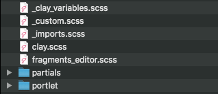
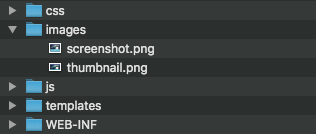
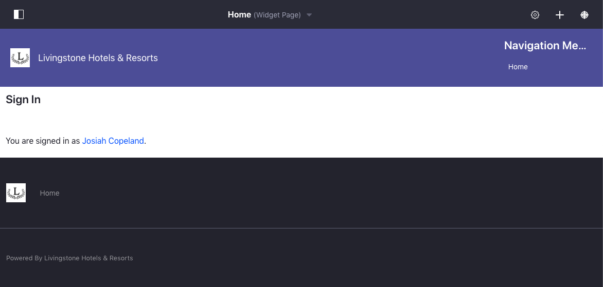

# Exercise 2: Modify the Styling of the Themes

[$LIFERAY_LEARN_YOUTUBE_URL$]=https://www.youtube.com/embed/C7nNIWCTMxE

## Exercise Goals
	
* Customize and modify variables
  * Modify Clay Base variables
  * Add custom theme variables to the theme   
* Modify components and global styles
  * Modify Clay Base partials
  * Add custom CSS and import it into the source file
* Add custom images

## Add the SCSS File Structure to the Theme Source
1. **Copy** the contents of the `exercise-src\css` folder.  
2. **Paste** the files into your `livingstone-fjord-theme\src\css` folder.



## Modify Clay Variables to Fit Branding 
1. **Drop** `_clay_variables.scss` from `livingstone-fjord-theme\src\css` into the _Visual Studio Code_ editor. 
2. **Click** to highlight the `// Insert snippet 01-custom-clay-variables here` comment.
3. **Type** `lfr` to view the available code snippets.
4. **Choose** the `01-custom-clay-variables` snippet.
5. **Save** the file. 
    * Alternatively, you can type and save the following:

```SCSS
$body-bg: white;
$bright-color: #1865FB;
$complementary-color: #869CAD;
$dark-color: #242529;
$light-color: #E7E7ED;
$solid-color: #47647A;

$portlet-decorate-bg: #FFF;
$portlet-decorate-border: 1px solid $light-color;
```

## Add Color Variables for the Theme
1. **Drop** `_colors.scss` from `livingstone-fjord-theme\src\css\partials\variables` into the _Visual Studio Code_ editor. 
2. **Click** to highlight the `// Insert snippet 02-colors-scss here` comment.
3. **Type** `lfr` to view the available code snippets.
4. **Choose** the `02-colors-scss` snippet.
5. **Save** the file.
    * Alternatively, you can type and save the following:

```SCSS
$fjord-primary: #5657A1;
$fjord-info: #7BC6DC;
$fjord-secondary: #BDCADB;
$fjord-success: #57D192;
```

## Import the Variable Partial Files
1. **Drop** `_variables.scss` from `livingstone-fjord-theme\src\css\partials` into the _Visual Studio Code_ editor. 
2. **Click** to highlight the `// Insert snippet 03-variables-scss here` comment.
3. **Type** `lfr` to view the available code snippets.
4. **Choose** the `03-variables-scss` snippet.
5. **Save** the file.
    * Alternatively, you can type and save the following:

```SCSS
@import "variables/colors";
```

## Customize the Portlet Variables
1. **Drop** `_variables_custom.scss` from `livingstone-fjord-theme\src\css\portlet` into the _Visual Studio Code_ editor. 
2. **Click** to highlight the `// Insert snippet 04-portlet-variables-custom-scss here` comment.
3. **Type** `lfr` to view the available code snippets.
4. **Choose** the `04-portlet-variables-custom-scss` snippet.
5. **Save** the file. 
    * Alternatively, you can type and save the following:

```SCSS
$portlet-header-margin-bottom: map-get($spacers, 5);

$portlet-topper-bg: #F1F5FF;
$portlet-topper-border: #D7E5FF;
$portlet-topper-color: map-get($theme-colors, primary);
$portlet-topper-link-color: map-get($theme-colors, primary);
$portlet-topper-link-hover-color: map-get($theme-colors, primary);

$portlet-content-border-radius: 0 0 8px 8px;
$portlet-topper-border-radius: 4px 4px 0 0;
```

## Customize the Button Component
1. **Drop** the `_buttons.scss` file found in `livingstone-fjord-theme\src\css\partials` into the _Visual Studio Code_ editor. 
2. **Click** to highlight the `// Insert snippet 05-buttons-scss here` comment.
3. **Type** `lfr` to view the available code snippets.
4. **Choose** the `05-buttons-scss` snippet.
5. **Save** the file.
    * Alternatively, you can type and save the following:

```SCSS
.fjord-btn-primary {
	@include button-variant($fjord-primary, $fjord-primary);
}
```

## Add Custom Styling to the Footer
1. **Drop** the `_footer.scss` file found in `livingstone-fjord-theme\src\css\partials` into the _Visual Studio Code_ editor.
2. **Click** to highlight the `// Insert snippet 06-footer-scss here` comment.
3. **Type** `lfr` to view the available code snippets.
4. **Choose** the `06-footer-scss` snippet.
5. **Save** the file.
    * Alternatively, you can type and save the following:

```SCSS
.footer {
    a {
        color: inherit;

        &:hover,
        &:focus {
            color: white;
        }
    }

    // Insert snippet 10-social-media-footer-scss here
}
```

## Import Partials to Custom.scss
1. **Drop** the `_custom.scss` file found in `livingstone-fjord-theme\src\css` into the _Visual Studio Code_ editor.
2. **Press** *Enter* below the existing imports.
3. **Type** `lfr` to view the available code snippets.
4. **Choose** the `07-custom-scss-imports` snippet.
5. **Save** the file.
    * Alternatively, you can type and save the following:

```SCSS
@import "partials/variables";

@import "partials/backgrounds";
@import "partials/buttons";
@import "partials/footer";
@import "partials/header";
@import "partials/texts";

@import "portlet/portlet_decorator";
```

## Add Theme Images
1. **Copy** the contents of the `images` folder from `exercise-src`.   
2. **Paste** the contents into `livingstone-fjord-theme/src/images`.
    * You will need to replace the thumbnail image.



## Add the Livingstone Logo
1. **Click** _Site Administration_ → _Site Builder_ → _Pages_ in the _Menu_ for the _Livingstone Hotels & Resorts_ site.
2. **Click** the gear icon next to _Public Pages_.
3. **Click** to expand the _Logo_ section near the bottom of the page.
4. **Click** _Change_ → _Select_.
5. **Choose** the `livingstone-logo.png` file from the `exercise` folder.
6. **Click** _Done_.
7. **Click** to set the _Show Site Name_ slider to _No_.
8. **Click** _Save_.

## Deploy the Theme to See the Styling Changes
1. **Run** `npm run gulp deploy` in the _Command Line_ or the _Terminal_. 
    * If you're already running gulp watch, this isn't needed.



---

## Next Up

* [Adding Custom JavaScript to a Theme](./adding-custom-javascript-to-theme.md)

## Previous Step

* [Adding Custom Styling to the Platform](./adding-custom-styling-to-platform.md)