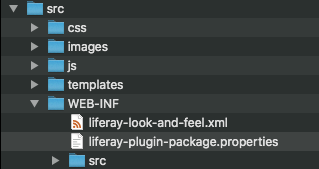
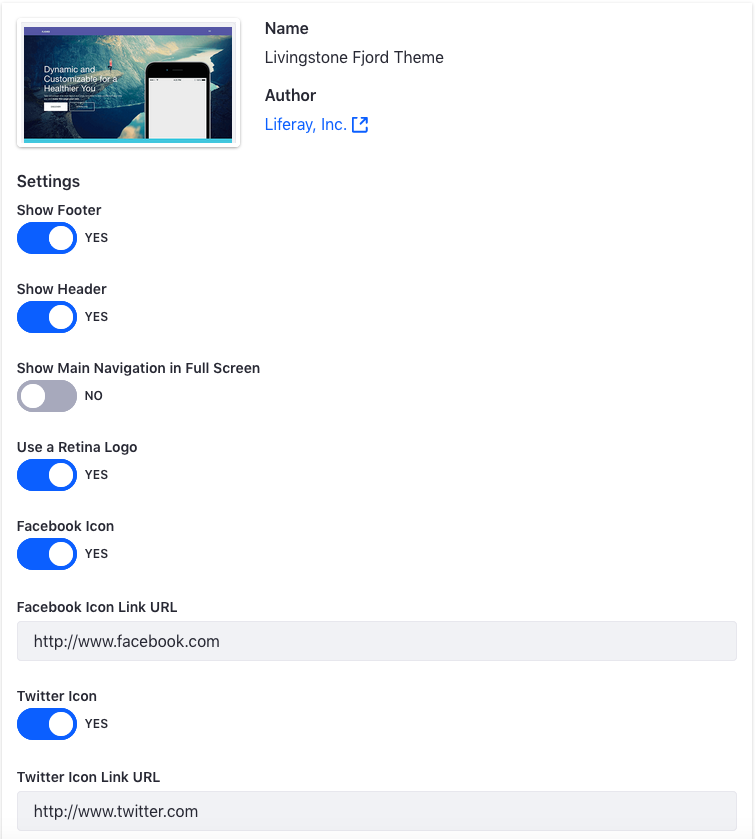

# Exercise 4: Configure the Theme to Provide Administrative Options

[$LIFERAY_LEARN_YOUTUBE_URL$]=https://www.youtube.com/embed/SyD5bY20kYw

## Exercise Goals
    
* Add Portlet Decorators to the theme      
    * Add the Configuration files
    * Add styling for the Portlet Decorators
* Add Custom Theme Settings
    * Add Theme Settings
    * Create Theme Setting Variables
    * Add FreeMarker Files and Styling for Theme Settings

## Add WEB-INF Files to the Theme

1. **Copy** the `liferay-plugin-package.properties` and `src` folder from the `exercise-src/WEB-INF` folder.  
2. **Paste** the files into the `livingstone-fjord-theme/src/WEB-INF` folder.
    * You'll need to replace the existing `liferay-plugin-package.properties`.



## Add Portlet Decorators

1. **Drop** the `liferay-look-and-feel.xml` file from `livingstone-fjord-theme/src/WEB-INF` into the _Visual Studio Code_ editor.
2. **Click** to highlight the `<!-- Insert snippet 01-portlet-decorators here -->` comment.
3. **Type** `lfr` to view the available code snippets.
4. **Choose** the `01-portlet-decorators` snippet.
5. **Save** the file.  
    * Alternatively, you can type and save the following:

```XML
<portlet-decorator id="barebone" name="Barebone">
  <portlet-decorator-css-class>portlet-barebone</portlet-decorator-css-class>
</portlet-decorator>
<portlet-decorator id="borderless" name="Borderless">
  <portlet-decorator-css-class>portlet-borderless</portlet-decorator-css-class>
</portlet-decorator>
<portlet-decorator id="decorate" name="Decorate">
  <default-portlet-decorator>true</default-portlet-decorator>
  <portlet-decorator-css-class>portlet-decorate</portlet-decorator-css-class>
</portlet-decorator>
<portlet-decorator id="solid" name="Solid">
  <portlet-decorator-css-class>portlet-solid</portlet-decorator-css-class>
</portlet-decorator>
```

## Add Sass Styling for the Portlet Decorator

1. **Drop** the `_portlet_decorator.scss` from `livingstone-fjord-theme\src\css\portlet` into the _Visual Studio Code_ editor.
2. **Click** to highlight the `// Insert snippet 09-portlet-decorator-scss here` comment.
3. **Type** `lfr` to view the available code snippets.
4. **Choose** the `09-portlet-decorator-scss` snippet.
5. **Save** the file.   
    * Alternatively, you can type and save the following:

```SCSS
.portlet-decorate {
    .portlet {
        margin-bottom: 0;
    }

    .portlet-content {
        border-width: 0;
        padding: 0;
    }
}

.portlet-solid .portlet-content {
    background: #FFF;
    border: 1px solid #DEEEEE;
}

.portlet-barebone .portlet-content {
    padding: 0;
}
```

## Add Custom Theme Settings to the Theme XML File

1. **Drop** the `liferay-look-and-feel.xml` from `livingstone-fjord-theme\src\WEB-INF` into the _Visual Studio Code_ editor.
2. **Click** to highlight the `<!-- Insert snippet 02-theme-settings here -->` comment.
3. **Type** `lfr` to view the available code snippets.
4. **Choose** the `02-theme-settings` snippet.
5. **Save** the file.   
    * Alternatively, you can type and save the following:

```XML
<setting configurable="true" key="facebook-icon" type="checkbox" value="true" />
<setting configurable="true" key="facebook-icon-link-url" value="http://www.facebook.com" />
<setting configurable="true" key="twitter-icon" type="checkbox" value="true" />
<setting configurable="true" key="twitter-icon-link-url" value="http://www.twitter.com" />
```

## Add Custom Variables in the Init_Custom File

1. **Drop** the `init_custom.ftl` from `livingstone-fjord-theme\src\templates` into the _Visual Studio Code_ editor.
2. **Click** to highlight the `<#-- Insert snippet 06-init-custom-settings here -->` comment.
3. **Type** `lfr` to view the available code snippets.
4. **Choose** the `06-init-custom-settings` snippet.
5. **Save** the file.
    * Alternatively, you can type and save the following:

```html
facebook_icon = getterUtil.getBoolean(themeDisplay.getThemeSetting("facebook-icon"))
facebook_icon_link_url = themeDisplay.getThemeSetting("facebook-icon-link-url")
twitter_icon = getterUtil.getBoolean(themeDisplay.getThemeSetting("twitter-icon"))
twitter_icon_link_url = themeDisplay.getThemeSetting("twitter-icon-link-url")
```

## Add Social Media Icons to the Theme Footer

1. **Drop** the `portal_normal.ftl` from `livingstone-fjord-theme\src\templates` into the _Visual Studio Code_ editor.
2. **Click** to highlight the `<#-- Insert snippet 07-social-portal-normal here -->` comment.
3. **Type** `lfr` to view the available code snippets.
4. **Choose** the `07-social-portal-normal` snippet.
5. **Save** the file.
    * Alternatively, you can type and save the following:

```html
<div class="ml-md-auto mt-3 mt-md-0">
    <#include "${full_templates_path}/social_media.ftl" />
</div>
```

## Add the Code to the Social Media FreeMarker File

1. **Drop** the `social_media.ftl` from `livingstone-fjord-theme\src\templates` into the _Visual Studio Code_ editor.
2. **Click** to highlight the `<#-- Insert snippet 08-social-media-footer here -->` comment.
3. **Type** `lfr` to view the available code snippets.
4. **Choose** the `08-social-media-footer` snippet.
5. **Save** the file.
    * Alternatively, you can type and save the following:

```html
<#if facebook_icon || twitter_icon>
    <ul class="list-inline mb-0">
        <#if facebook_icon>
            <li class="list-inline-item">
                <a class="bg-white bg-white-10 d-block fjord-social fjord-text-primary
                rounded-circle text-center text-decoration-none text-primary" href="${facebook_icon_link_url}" rel="external" target="_blank" title="Go to our Facebook (in new window)">
                    <span class="fa fa-facebook icon-monospaced"></span>
                </a>
            </li>
        </#if>
        <#if twitter_icon>
            <li class="list-inline-item">
                <a class="bg-white bg-white-10 d-block fjord-social fjord-text-info
                rounded-circle text-center text-decoration-none text-info" href="${twitter_icon_link_url}" rel="external" target="_blank" title="Go to our Twitter (in new window)">
                    <span class="icon-monospaced fa fa-twitter-square"></span>
                </a>
            </li>
        </#if>
    </ul>
</#if>
```

## Add Sass Styling to Social Media Icons

1. **Drop** the `_footer.scss` from `livingstone-fjord-theme\src\css\partial` into the _Visual Studio Code_ editor.
2. **Click** to highlight the `// Insert snippet 10-social-media-footer-scss here` comment.
3. **Type** `lfr` to view the available code snippets.
4. **Choose** the `10-social-media-footer-scss` snippet.
5. **Save** the file.
    * Alternatively, you can type and save the following:

```SCSS
.fjord-social {
    @include size(64px);
    line-height: 64px;

    &:hover,
    &:focus {
        color: white !important;
    }
}
```

## Deploy the Theme to See the JavaScript Changes

1. **Run** `npm run gulp deploy` in the _Command Line_ or _Terminal_.
    * If you're already running gulp watch, this isn't needed.
    * You may need to reselect the Livingstone Fjord theme, if the default theme is still shown after refreshing the page. 



---

## Next Up

* [Using Themelets](./using-themelets.md)

## Previous Step

* [Configuring the Theme](./configuring-the-theme.md)