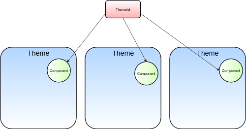

# Using Themelets

[$LIFERAY_LEARN_YOUTUBE_URL$]=https://www.youtube.com/embed/6cX2Sfw9VR8

Although Themes are used for global styling, a business with multiple sites might require custom styling tailored to each individual site while maintaining some common components. If they are using multiple themes to accomplish these business requirements, they can take advantage of Themelets to re-use those common styles and components.

## Livingstone and Themelets

Livingstone Hotels & Resorts might want all their sites to use the same font, or a particular menu design, while providing a different overall look-and-feel for each hotel location. This can, of course, be accomplished by creating additional themes for each of the hotel sites. Kaito and the web development team want to provide some user interface components that can be shared across themes and updated individually:
  1. Better visualization when moving widgets onto a page 
  2. Modern animation that emphasizes the menu when opened

It would save them a lot of time if they did not need to copy the necessary code for these components into every theme and then copy any updates to that code into every theme. It is useful for developers to customize UI components that can be shared across their themes.

## What are Themelets?

Themelets can consist of CSS (SCSS), HTML templates (FreeMarker), images, or JavaScript, just like the larger themes. Typically, Themelets are small snippets of code, such as a component implemented through SCSS.

```{important}
Key Point: <br>
Themelets are small, extendable, and reusable pieces of code that can be implemented by a theme.
```

Themelets exist as npm packages and can be published to the npm registry for easy sharing and reuse between themes. This will cut down on repetition. Themelets can either be created entirely new or taken from the npm registry.

> Note: You can find the complete list of themelets on the npm registry. Publishing or extending from this list allows for collaboration with other developers looking to create reusable snippets of code. You can find themelets on the npm registry, here: [https://www.npmjs.com/search?q=Themelet](https://www.npmjs.com/search?q=Themelet).



## Using Themelets

The Theme generator is packaged with the Themelet sub-generator. Similar to building a new theme, developers can run `yo liferay-theme: themelet` in the _Command Line_ or _Terminal_ to build a new themelet. After naming the Themelet and choosing the appropriate Liferay version (7.1), the Themelet should appear with a src folder and a .json package. The src directory acts similarly to the theme src, in that all custom code should go here. The default build will include a css folder.

| File | Description |
| --- | --- |
| `src` | Contains src files of the themelet |
| `src/css/_custom.scss` | Contains themelet styles that get automatically injected in the theme on the theme build |
| `package.json` | Where themelet metadata is defined |

```{important}
Key Point: <br>
Themelets can include FreeMarker Templates or JavaScript files, but they'll need to be included in src folders that reflect a theme, such as src/templates or src/js.
```

There are two different approaches to making a themelet available that can be utilized by a theme:  
1. `npm link`: Creates a symlink in the global npm module directory  
2. `npm install -g`: Copies the files into the theme
   - Using this second method, it is necessary to re-run the command every time changes are made to your themelet.

When running the npm link command, you will need admin access in the directory. Unix-based systems may need to run `sudo npm link`.

Once the themelet is made available, developers can install it in any theme using the _Command Line_ or _Terminal_. They simply need go to the root folder of the custom theme they want to add the themelet to, run `npm run gulp extend`, and select the themelet. After selecting `Search globally installed npm modules`, they will see the list of existing themelets. Finally, they can run `npm run gulp deploy` from the custom theme root folder and the Themelet should be added as an _npm dependency_.

> Note: the build task is also run during the deploy and deploy:gogo tasks, so themelet files will also be injected when the theme is deployed.

Themelets are fast and easy to create and will make adding any common components between themes simple. 

## Knowledge Check

Themelets are small code snippets or components and can be _________________________ across themes.
* Themelets can consist of the same file types as themes (____________, ____________, ____________, and _________________________.)
* Use the __________________________________________________________ command to generate a themelet.
* Themelets must be visible ____________________________ in order to be used by all your Liferay themes.
  * Use either the _________________________________ command or __________________________________ command.
* A Themelet must be ___________________________ in a theme in order to be used by that theme.

---

## Next Up

* [Exercise 5: Create Themelets to Deploy with the Theme](./exercise-5-create-themelets-to-deploy-with-theme.md)

## Previous Step

* [Exercise 4: Configure the Theme to Provide Administrative Options](./exercise-4-configure-theme-to-provide-administrative-options.md)