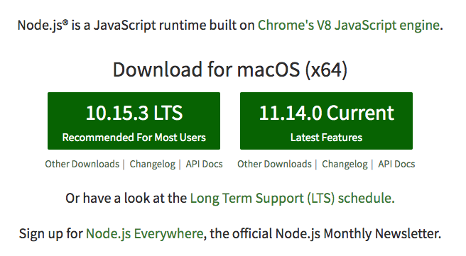
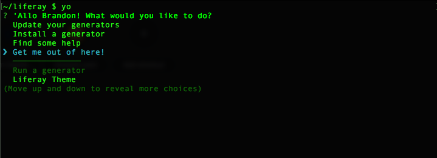
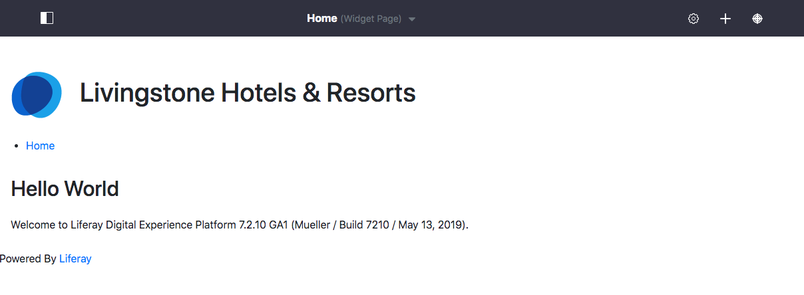

# Exercise 1a: Set up and Deploy with the NPM Theme Generator

[$LIFERAY_LEARN_YOUTUBE_URL$]=https://www.youtube.com/embed/3W7xFErrXG4

## Exercise Goals
	
* Use the NPM Theme generator to quickly generate and deploy a theme
	* Set up a local instance of Liferay
	* Install the NPM tools to create and deploy front-end modules
	* Create a basic Theme Module
	* Deploy the basic Theme Module to the local instance of Liferay
	* Select the Theme Module on the platform

## Install a Liferay Tomcat Bundle in a New Bundles Folder

1. **Create** a new `bundles` folder in your liferay folder so that you have a directory that looks like this:
	* Windows: _C:\liferay\bundles_
	* Unix Systems: _[user-home]/liferay/bundles_
2. **Expand** the `liferay-dxp-tomcat-[version]` file to the bundles directory.  
	* Windows: liferay-dxp-tomcat-[version].zip
	* Unix Systems: liferay-dxp-tomcat-[version].tar.gz

> Note: This file can be found in the software materials provided by the instructor. Windows' built-in archive tool causes problems with Liferay when it tries to extract the large .zip file. We recommend using a third-party tool, like 7-Zip or WinZip.

## Set the Tomcat Bundle to Developer Mode

1. **Copy** the _portal-ext.properties_ file from this module's exercise folder.
2. **Paste** the file into the _liferay home_ folder.
	* Windows: _C:\liferay\bundles\liferay-dxp-tomcat-[version]_
	* Unix Systems: _[user-home]/liferay/bundles/liferay-dxp-tomcat-[version]_

## Install Node v10.15.1

1. **Go to** [https://nodejs.org/download/release/v10.15.1/](https://nodejs.org/download/release/v10.15.1/).
2. **Click** the appropriate installer for your operating system.
3. **Click** through the installer.
4. **Open** a _Command Line/Terminal_ window.  
5. **Run** `node -v` in your _Command Line_ to verify your installation once you have installed node.js and npm.
6. Run `npm -version` to double-check that the appropriate version is installed.
	* The npm version should be 6.x.x or above.

> Note: It is possible you may run into errors with the latest LTS version of Node. To avoid this, we recommend using Node version 10.15.1 as shown above.



## Mac OSX and Linux: Redirect the NPM Global Command

1. **Create** an `.npmrc` file in your user home.
	* You can navigate here in your _Terminal_ using `cd ~/[username]`.
2. **Add** the following in your `.npmrc` file:

```
prefix=/Users/[username]/.npm-packages
```

3. **Save** the file.
4. **Open** your `.profile` file.
	* Use the shortcut `CMD + SHIFT + .` to view hidden files in your user home.
5. **Add** the following to your `.profile` file:

```
export NPM_PACKAGES=/Users/[username]/.npm-packages
export PATH=${PATH}:${NPM_PACKAGES}/bin
```

6. **Save** the file.
7. **Restart** the _Terminal_ for the changes to take place.

## Install Yeoman and the Liferay Theme Generator

1. **Run** `npm install -g yo` to install the Yeoman and Gulp dependency.  
2. **Run** `npm install -g generator-liferay-theme@9.x.x` to install the Liferay Theme Generator.  
3. **Run** `yo` in the _Command Line/Terminal_ to see that the generator is installed.  
	* Type _Y or N_ if an initial prompt asks to collect data.    
4. **Choose** _Get me out of here!_



## Start the Liferay-Tomcat Bundle

1. **Go to** the Tomcat server's `bin` directory:
	* Windows: _C:\liferay\bundles\liferay-dxp-[version]\tomcat-[version]\bin_ in the file manager
	* Mac/Linux: _[userhome]/liferay/bundles/liferay-dxp-[version]/tomcat-[version]/bin_ using the _Terminal_
2. **Start** the Tomcat Server:
	* Windows: **Double-click** on the `startup.bat`.  
	* Mac/Linux: **Run** `./catalina.sh run` in your _Terminal_.

## Deploy the Activation Key

1. **Copy** the _activation-key-digitalenterprisedevelopment-7.2-liferaycom.xml_ file from your provided materials.
2. **Paste** the file into your _liferay-dxp-[version]/deploy_ folder.
	* You should see that the Activation Key is registered in the _Terminal_ or _Command Line_ window.

## Complete the Liferay Setup Wizard

1. **Go to** _localhost:8080_ in the browser.
	* You may be redirected here already.
2. **Type** _Livingstone Hotels & Resorts_ as the _Portal Name_.
3. **Type** _Josiah_ for the _First Name_.
4. **Type** _Copeland_ for the _Last Name_.
5. **Type** `josiah.copeland@livingstone.com` for the _Email_.
6. **Click** _Finish Configuration_.
	* This will start the platform with the default HSQL database.
7. **Click** _I Agree_ for the _Terms of Use_ placeholder.
8. **Type** a new password for your account.
9. **Click** _Save_.
10. **Choose** a password reminder query.
11. **Type** in an answer.
12. **Click** _Save_.

## Create a New Theme to Deploy

1. **Go to** your _`liferay`_ folder in your _Command Line/Terminal_.
	* Windows: _C:\liferay_
	* Unix Systems: _[userhome]/liferay_
2. **Run** _yo liferay-theme_.
3. **Type** _My Test Theme_ for the _theme name_.
4. **Press** _Enter_ to accept the default _themeId_.
5. **Choose** _7.2_ for the _version_.
6. **Type** _Y_ to use _Font Awesome_ in the theme.
7. **Choose** _Local App Server_ for the _deployment strategy_.
8. **Add** the app server directory path:
	* Windows: _C:\liferay\bundles\liferay-dxp-[version]\tomcat-[version]_
	* Unix Systems: _[user-home]/liferay/bundles/liferay-dxp-[version]/tomcat-[version]_
9. **Press** _Enter_ to accept the default url.

> Note: Liferay themes created with the theme generator are bundled with Gulp. In order to run Gulp locally from the command line, we must add a script to the package.json file. Additionally, some setups run into issues running scripts with npm. If this is the case, try creating an .npmrc file in the root of your project and add the `ignore-scripts=false` configuration.

## Add Gulp Scripts to package.json

1. **Go to** your `my-test-theme` folder.
2. **Open** your `package.json` file.
3. **Add** the following beneath the "liferayTheme" dependencies:
```
"scripts": {
	"gulp": "node_modules/.bin/gulp"
},
```
4. **Save** the file.

When you're finished, `package.json` should look something like this:

```
{
	"devDependencies": {
		"compass-mixins": "0.12.10",
		"gulp": "3.9.1",
		"liferay-frontend-common-css": "1.0.4",
		"liferay-frontend-theme-styled": "4.0.7",
		"liferay-frontend-theme-unstyled": "4.0.4",
		"liferay-theme-tasks": "^9.4.3",
		"liferay-font-awesome": "3.4.0"
	},
	"keywords": [
		"liferay-theme"
	],
	"liferayTheme": {
		"baseTheme": "styled",
		"fontAwesome": true,
		"screenshot": "",
		"templateLanguage": "ftl",
		"version": "7.2"
	},
	"scripts": {
		"gulp": "node_modules/.bin/gulp"
	},
	"main": "package.json",
	"name": "my-test-theme",
	"version": "1.0.0"
}
```

## Deploy the Theme

1. **Go to** your new theme directory in the _Command Line/Terminal_:
	* Windows: _C:\liferay\my-test-theme_
	* Unix Systems: _[userhome]/liferay/my-test-theme_
2. **Run** _npm run gulp deploy_ in the _Command Line/Terminal_.

## Select the New Theme on the Platform
1. **Log in** to _localhost:8080_ if you're not already logged in.
2. **Open** the _Menu_.
3. **Go to** _Site Builder_ → _Pages_ in the _Site Administration_ panel.
4. **Click** on the configuration icon next to _Public Pages_.
5. **Click** _Change Current Theme_.
6. **Choose** the _My Test_ theme.
7. **Click** _Save_.
8. **Click** _Go to Site_ in the _Site Administration_ panel to see the base theme without any customization.



---

## Bonus Exercises

1. Change the theme back to the _Classic_ theme.
2. Explore the new theme project and add some css to the _custom.scss_ file in the _src_ folder and deploy the changes. 

---

## Next Up

* [Exercise 1b: Deploy with the NPM Bundle Generator](./exercise-1b-deploy-with-npm-bundle-generator.md)

## Previous Step

* [Front-End Development Tools](./front-end-development-tools.md)