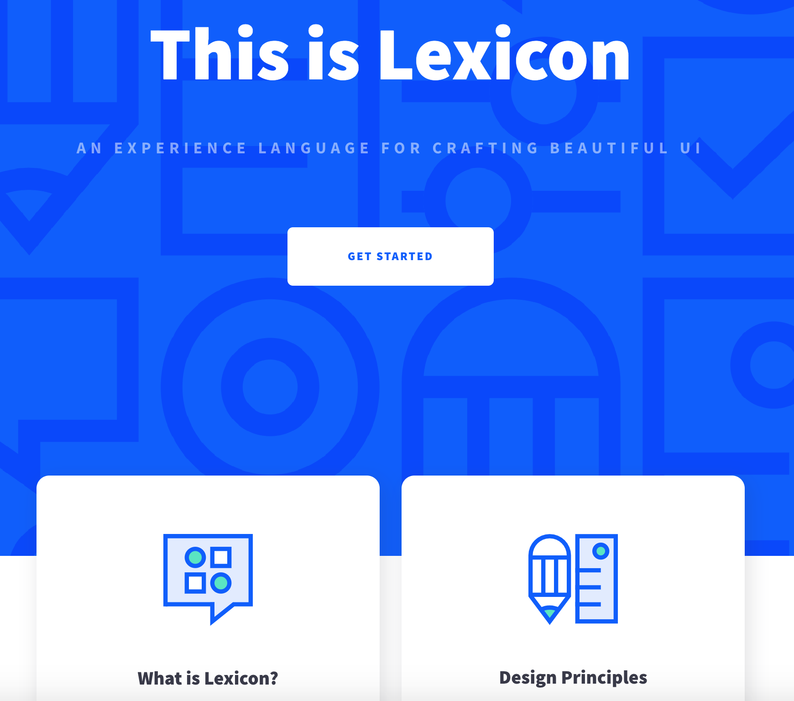
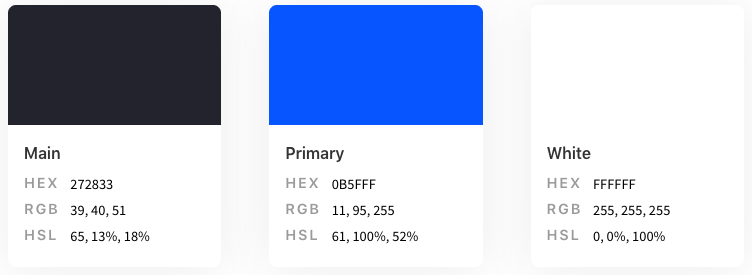
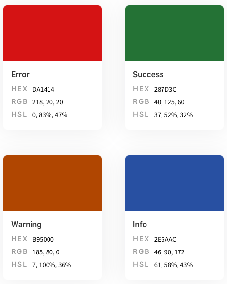
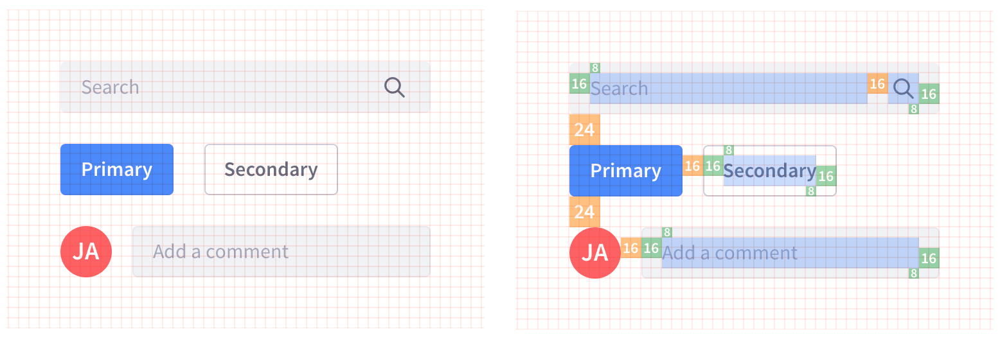
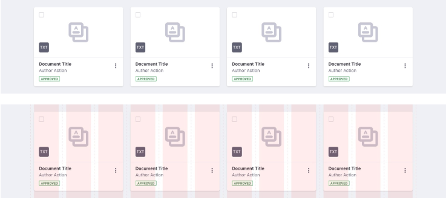
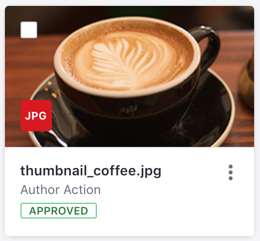
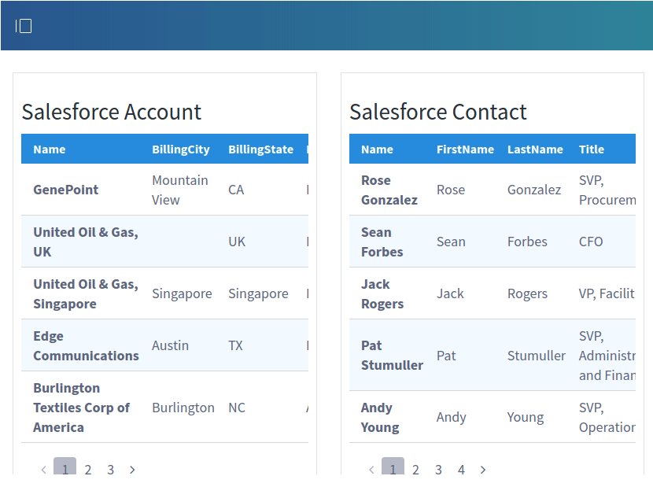
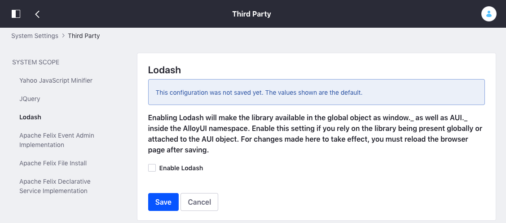
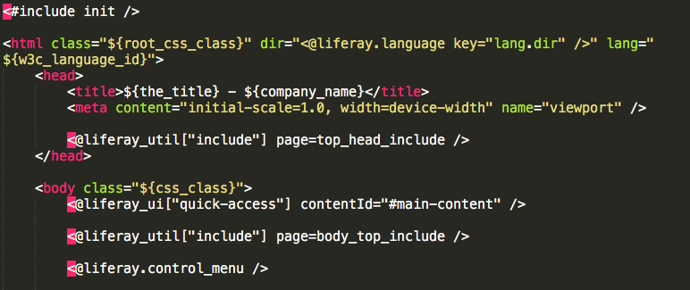

# Front-End Development Frameworks

[$LIFERAY_LEARN_YOUTUBE_URL$]=https://www.youtube.com/embed/2Yl39q701jk

There are many different programming languages and frameworks that developers can use to craft their user experiences. Each of these frameworks comes with its own unique features and libraries that provide more flexibility and give more power. The Liferay platform includes many of these frameworks out-of-the-box in order to create the best developer experience.


## Liferay's Experience Language: Lexicon

You'll want to craft a consistent look-and-feel across your platform so that users don't feel any abrupt change. Because of this, many large companies like Google and Apple have created their own Design Language.
Design Languages are intended to help developers determine how to best integrate into the platform they're using. These languages act as a blueprint that developers can use to ensure their applications or content look consistent. Liferay comes with its own Design Language, the _Lexicon Experience Language_.

```{important}
Key Point: <br>
**Lexicon** is a design language that provides a common framework for building interfaces within the Liferay product ecosystem.
  <ul>
      <li>
        Lexicon takes a modular approach with the Atomic Design approach, which lends a more hierarchical and organized structure to the creation of interface design systems.
      </li>
      <li>
        Lexicon is not an implementation, but a set of patterns, rules, and behaviors that any library can implement. 
      </li>
    </ul>
```



## Lexicon Design Principles

Lexicon enables developers to craft consistent user experiences by detailing the different design principles behind the platform implementation. 

```{important}
Key Point: <br>
Lexicon includes a number of design principles that, when followed, help you maintain a consistent design on the Liferay platform. These principles cover the following elements:
  <ul>
      <li>Accessibility</li>
      <li>Animations</li>
      <li>Color</li>
      <li>Grid Structure</li>
      <li>Responsive Layout</li>
      <li>Typography</li>
      <li>Writing Style</li>
    </ul>
```

Lexicon has some primary colors to set the visual identity of Lexicon. This sets the color schemes and variation expectation. Each of these colors is used for different aspects of the design and include variations:

* _Main_: Texts/icons, navigation background, borders, and dividers
* _Primary_: Main actions like primary buttons, links, hover, and active
* _White_: Cards background, toolbar background, modals, forms, and texts/icons



There are also secondary colors used for other aspects of the platform. One example is different messages you see, like success or error messages. Secondary colors are frequently used and still important, but they do not define the visual identity as much as primary colors.



In order to maintain visual consistency across the platform, Lexicon design includes a base grid that determines the dimensions of and distances between components. This grid is constructed from a base 8px module so that both the dimensions of the components and the distances between them will always be multiples of 8: 16, 24, 32, 40, 48, etc. 



Lexicon Design also includes a responsive 12-column structure based on the Bootstrap CSS grid. Different components will be positioned with the appropriate distance.



The following includes the responsive breakpoints:


When it comes to a typography in the design system, the System font will be selected for the following reasons:
* There is no access problem to it. It doesn't depend on CDN.
* System fonts are thought to work in a wide range of languages.
* It reduces significantly the amount of CSS to download.
* A wider range of font weights is provided without the download cost.
* The system font is usually more readable.
* The system font is more natural, as the user is used to it from the OS.

Finally, for whenever text is used, Lexicon has writing standards that include the following:
* **Be Clear**: Be concise and easy to understand
* **Be Confident**: Be straightforward in what is stated
* **Be Current**: Use present tense throughout product messaging
* **Be Consistent**: Apply text styles and how you address users consistently

>Note: You can find more information on the Lexicon site: https://liferay.design/lexicon">https://liferay.design/lexicon

## Lexicon Design Implementation: Clay

In order to implement the Lexicon design, Liferay has created the Clay CSS framework. Clay is modeled after Lexicon's pattern library, allowing developers to be confident that their web application's UI will have a consistent style and user experience.

```{important}
Key Point: <br>
Clay is Liferay's web implementation of the Lexicon Experience Language, which is:
  <ul>
      <li>Built on a Bootstrap foundation, translating LESS to SASS</li>
      <li>Made up of HTML, CSS, and JavaScript</li>
    </ul>
```


> Note: In Liferay 7.2, Clay takes advantage of Bootstrap 4.3. This may lead to issues or breaking changes in themes created prior to 7.1, which would have been based on Bootstrap 3.

Clay has a large component library. Each component is like a building block that can be used with other components to create different designs. Each of the Clay components and elements can also be modified within the context of a Liferay theme. 

Developers have access to the SCSS files for each component from the context of the theme. Those classes can simply be added to html structures to create the Clay components in both themes and templates. 

For example, if we were to look at the card component, developers could modify the base styling in a theme and then combine it with other components, such as labels, stickers, or icons, to implement the design he needs. 

```html
 <div class="card-type-asset form-check form-check-card form-check-top-left image-card">
    <div class="card">
        <div class="aspect-ratio card-item-first">
            <div class="custom-control custom-checkbox">
                <label>
                    <input class="custom-control-input" type="checkbox">
                    <span class="custom-control-label"></span>
                    
                    <span class="sticker sticker-bottom-left sticker-danger">JPG</span>
                </label>
            </div>
        </div>
        <div class="card-body">
            <div class="card-row">
                <div class="autofit-col autofit-col-expand">
                    ...
                </div>
                <div class="autofit-col">
                    <div class="dropdown dropdown-action">
                        <a aria-expanded="false" aria-haspopup="true" class="dropdown-toggle" data-toggle="dropdown" href="#1" role="button">
                            <svg aria-hidden="true" class="lexicon-icon lexicon-icon-ellipsis-v">
                                <use xlink:href="/vendor/lexicon/icons.svg#ellipsis-v" />
                            </svg>
                        </a>
                        ...
                    </div>
                </div>
            </div>
        </div>
    </div>
</div>
```

By combining some of the Clay classes like card, sticker, icon, etc, like the above, Kaito and his team would get the following output:



## JavaScript in Liferay DXP

Along with a styling framework, developers need to manipulate the DOM to provide interactive pop-ups, visually appealing search features, and different applications or widgets to place on sites. There are a number of places developers can add JavaScript to the platform. 

```{important}
Key Point: <br>
Developers can use JavaScript on the platform in the following ways:
  <ul>
      <li>Adding global JavaScript through Themes</li>
      <li>Adding JavaScript to platform Templates and Fragments</li>
      <li>Creating custom JavaScript modules with the following frameworks:</li>
      <ul>
        <li>Standard JavaScript </li>
        <li>Angular</li>
        <li>React</li>
        <li>Vue.js</li>
        <li>Metal.js</li>
      </ul>
    </ul>
```



## Using Different JavaScript Libraries

There are a couple of JavaScript frameworks built into the platform by default that the front-end development team can take advantage of. 

```{important}
Key Point: <br>
The two JavaScript frameworks that developers can use out-of-the-box with Liferay are the following:
  <ul>
      <li><b>Metal.js</b>: Built for internal purposes at Liferay, Metal.js is a foundation for creating UI components that automatically respond to data when it's updated.</li>
      <li><b>JQuery</b>: jQuery is a JavaScript library that makes things like HTML document traversal and manipulation, event handling, animation, and Ajax simple.</li>
    </ul>
```

In 7.1, Lodash was included in every page by default and made available through the global window and scoped AUI variables. Lodash is no longer included by default, and those variables are now undefined. As a temporary measure, you can bring back the old behavior by setting the _Enable Lodash_ property in Liferay Portal's _Control Panel_ → _Configuration_ → _System Settings_ → _Third Party_ → _Lodash_ to `true`.



Metal.js was developed at Liferay for creating one-way data binding components. Metal.js components can be written using either Soy or JSX templates. Metal.js’s main classes are State and Component. Component actually extends from State, so it contains all its features. The main difference between the two is that Component’s extra features are related to rendering. If your module doesn’t do any rendering, you could just use State directly. Component will work better for you if your module needs rendering logic. Many people have their favorite way of dealing with rendering logic. Some prefer to use template languages that completely separate the rendering logic from the business logic, while others like to keep both close together in the same file. Metal.js doesn’t force developers to go with only one option.

> Note: Metal.js isn't considered a Liferay best practice, but rather, another framework option if one-way data binding components meet the business needs of the company. Otherwise, development teams should feel free to use whatever framework works best for them.

Most developers have a variety of experiences with many other JavaScript frameworks. Liferay also provides the ability to integrate with whatever libraries you would prefer. In a case where developers want to load libraries that they host, libraries that they own, or other third-party libraries, they can load them into their UI module projects.

```{important}
Key Point: <br>
Developers can include other JavaScript libraries in their UI modules by doing the following:
  <ul>
      <li><i>Owned libraries</i>: Before loading as browser globals, the library needs to be configured so that it supports UMD.</li>
      <li><i>Browser loaded third-party libraries</i>: Add the script tag and the Liferay loader along with the library URL.</li>
      <li><i>Hosted libraries</i>: Name the library in the define function, remove the UMD wrapper, and configure your modules' build task to run the configJSModules task over the library.</li>
    </ul>
```

Adding JavaScript libraries can be done in a theme by simply adding the script tag and adding the URL. For example:

```
<script src="http://ajax.googleapis.com/ajax/libs/jqueryui/1.8/jquery-ui.min.js"></script>
```

For more information on how to use external JavaScript libraries, you can take a look at: [https://dev.liferay.com/develop/tutorials/-/knowledge_base/7-1/using-external-javascript-libraries](https://dev.liferay.com/develop/tutorials/-/knowledge_base/7-1/using-external-javascript-libraries)

## FreeMarker Templates in Liferay

When it comes to building HTML pages or templates, Liferay takes advantage of the FreeMarker template language to provide the ability to write semantic HTML as well as take advantage of FreeMarker Java API referencing and other features. 

```{important}
Key Point <br>
FreeMarker is the template language used in all of the front-end templates in Liferay. These templates include:
  <ul>
      <li>Templates in Theme Modules</li>
      <li>Web Content Templates</li>
      <li>Application Display Templates</li>
      <li>Layout Templates</li>
      <li>Workflow Email Notification Templates</li>
    </ul>
```

> Note: Support for Velocity and JSP Templates has been removed in DXP 7.2. If you have a theme using either of these, you should consider migrating it to FreeMarker. For more information, you can see the following:
> * [https://dev.liferay.com/en/develop/reference/-/knowledge_base/7-1/breaking-changes#removed-support-for-velocity-in-theme](https://dev.liferay.com/en/develop/reference/-/knowledge_base/7-1/breaking-changes#removed-support-for-velocity-in-themes)
> * [https://github.com/liferay/liferay-portal/blob/7.2.x/readme/BREAKING_CHANGES.markdown#removed-support-for-jsp-templates-in-themes](https://github.com/liferay/liferay-portal/blob/7.2.x/readme/BREAKING_CHANGES.markdown#removed-support-for-jsp-templates-in-themes)



FreeMarker templates in Liferay act as the intermediary between the back-end code in Java and the front-end code. They enhance HTML by adding constructs such as variables, conditional statements, and loops. Once it’s processed, the result is HTML, which is then styled by your CSS and displayed by the browser. FreeMarker provides a straightforward, clean, and simple method for incorporating dynamic content in a webpage. FreeMarker permits the user to use a simple yet powerful template language to reference objects defined in the Java code.

```{important}
Key Point <br>
FreeMarker has a number of constructs that can be used in addition to HTML. Developers can use things like:
  <ul>
      <li><b>Variables</b>: accessed by their names ${var_name}</li>
      <li><b>Arithmetic</b>: +, -, /</li>
      <li><b>Logical Operators</b>: &amp;&amp;, ||, &lt;=</li>
      <li><b>Sequence slices</b>: ${profile.assets[1..]}</li>
      <li><b>Including files</b>: [#include “nova.html”]</li>
      <li><b>Comments</b>: [#– this is a comment –]</li>
      <li><b>If, Else, Elseif Statements</b>: &lt;#if condition>&lt;/#if></li>
      <li><b>Macros/Taglibs</b>: &lt;@example.macro /></li>
    </ul>
```

Many of these construct examples are found in a theme project. For example, if a developer was developing the theme and wanted to use Liferay's API to create a configurable setting, he could assign a variable to a Java method:

```
 <#assign show_header_search = getterUtil.getBoolean(themeDisplay.getThemeSetting("show-header-search")) />
```

The variable can then be used in his FreeMarker template by using:

```
${show_header_search}
```

With variables created, developers can use them in _If_ statements with includes, macros, or just basic html. For example, if they wanted to add a specific footer FreeMarker file to keep the footer html structure in its own file, they could create a variable and add something like this to the HTML source file:

```
<#if has_footer>
  <#include "$full_templates_path}/footer.ftl" />
<#/if>
```

## Using Macros and Taglibs in Templates

When using templates in themes, there are several built-in variables, which we'll look at later. There are also several _macros_ and _taglibs_ that can be used to quickly add in functionality, and even embedded widgets, into your templates. As an example, if you wanted to add a navigation widget to the footer of the site pages, you could add the following into a custom theme's html source file:

```
<@liferay.navigation_menu
  instance_id="footer_navigation_menu"
  default_preferences="${freeMarkerPortletPreferences}"
/>
```

## Using Clay in Templates

Clay can also be used in Templates to add consistent design to content. To do this, developers can simply add any of these components to any of our html structures to inherit the styling needed for consistent design. 

If, for instance, the Design Team has required a user display presentation on the platform and the development team wanted to implement this using Clay, they could use the _card_ and _icon_ classes in his templates:

```html
<div class="card">
    <div class="crop-img crop-img-bottom crop-img-center">
        
    </div>
    <div class="user-icon user-icon-danger user-icon-xxl">
        <span>SN</span>
    </div>
    <div class="card-block">
        <h3>Space Nova</h3>
        <h5 class="text-default">Out-Of-This-World Trainer</h5>
        <p>The Most Interesting Man In Space.</p>
    </div>
</div>
```

With the above, they would see the following output:


## Knowledge Check

* ____________________ is a design language that provides a common framework for building interfaces within the Liferay product ecosystem.
* ____________________ is Liferay's web implementation of the Lexicon Experience Language, which is:
  * Built on a ____________________ foundation, translating LESS to ____________________ 
  * Made up of HTML, CSS, and JavaScript
* Developers can use JavaScript on the platform in the following ways:
  * Adding global JavaScript through ____________________
  * Adding JavaScript to platform ____________________ and ____________________ 
  * Creating custom JavaScript ____________________

---

## Next Up

* [Front-End Development Tools](./front-end-development-tools.md)

## Previous Step

* [Introducing Front-End Development](./introducing-front-end-development.md)