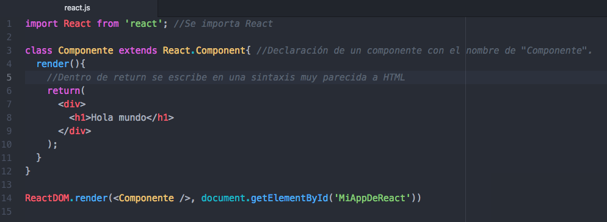
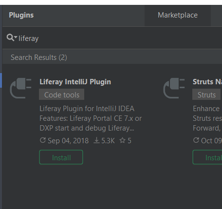
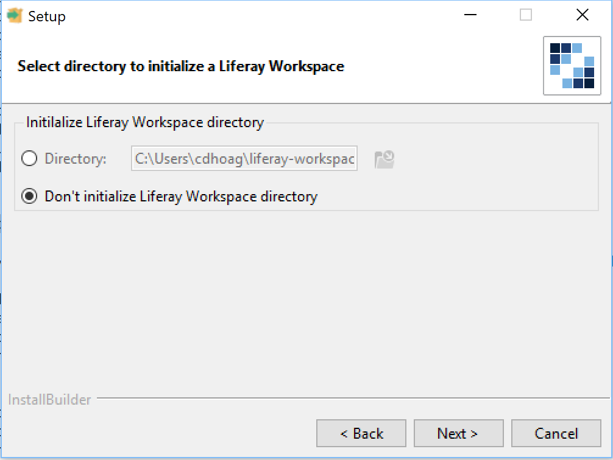
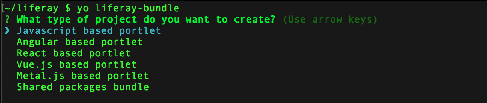

# Front-End Development Tools

[$LIFERAY_LEARN_YOUTUBE_URL$]=https://www.youtube.com/embed/Izwqg9rJSGI

Front-end developers need to be familiar with efficient development tools in order to implement business and design requirements. They also need to use tools that can work within a DevOps process. There are several tools available to developers working on the Liferay platform that allow them to do just that. 

## The Livingstone Team Toolset

Kaito Tanaka and his team of front-end developers need to create the following for the new Livingstone sites:
* New Themes for the different Livingstone Hotel and Resort sites
* Customized Layouts for specific widget pages
* Different Templates to control the content and widget presentation 
* Editable fragments for the page presentation on their sites
* React applications for Salesforce integration as well as other JavaScript components



## Understanding Tools for Liferay DXP

It's important to note that Liferay is tool-agnostic. Anything from a command prompt, text editor, or a full-blown IDE can be used to develop. Liferay DXP has introduced a number of new tools the team can take advantage of to simplify front-end module development. Developers can take advantage of Eclipse and IntelliJ IDEA IDE plugins, Yeoman generators within an npm workflow, or Liferay's Blade CLI.

Using these tools can give developers the edge by taking less time to get things set up and more time developing.

```{important}
Key Point: <br>
<li>Front-end developers can create theme, layout, and JavaScript modules using the following:</li>
  <ul>
      <li><b>Liferay NPM Toolkit</b>: This includes yeoman generators to build and deploy themes, layouts, fragments, and JavaScript modules.</li>
      <li><b>Blade CLI and Liferay Workspace</b>: Blade includes a number of project templates that can be used in a standalone environment or with a Liferay Workspace.</li>
      <li><b>Liferay Developer Studio</b>: This is a standalone package built on Eclipse that includes the Liferay IDE plugins. Alternatively, developers can simply add the Liferay IDE plugins to their existing eclipse IDE.</li>
      <li><b>Liferay IntelliJ Plugin</b>: This plugin can be integrated with IntelliJ IDEA and allows developers to create Gradle and Maven-based projects.</li>
  </ul>
```

## Developing with IntelliJ IDEA and Eclipse

Developers can use Liferay Developer Plugins with Eclipse or IntelliJ IDEA to develop different kinds of modules for the platform. These plugins give developers the tools to do the following:
* Create a Liferay Workspace (Gradle and Maven based)
* Create Liferay projects (Gradle and Maven based)
* Set up a Liferay Tomcat server for project deployment and debugging
* Add line markers for each entity in the service editor
* Syntax checking, highlighting, and code completion (e.g., Bnd and XML files)

These plugins can be installed through the Eclipse and IntelliJ marketplace. Alternatively, Liferay Developer Studio, which includes a pre-packaged eclipse set-up, is available for download from the Help Center.



> Note: For more information on this set-up, you can check the following documentation:
* Liferay IDE: https://dev.liferay.com/en/develop/tutorials/-/knowledge_base/7-1/installing-liferay-ide
* Liferay IntelliJ Plugin: https://dev.liferay.com/en/develop/tutorials/-/knowledge_base/7-1/installing-the-liferay-intellij-plugin

## Using the Blade CLI's Theme Template

Developers can also use the Blade CLI tool to build Liferay module projects. This tool can be used to create projects with a Liferay Workspace or in a standalone environment. Blade CLI is a command line tool bootstrapped to a Gradle-based environment that allows developers to do the following:
* Create projects (Gradle or Maven) that can be used with any IDE or development environment
* Create/manage Liferay Portal instances
* Deploy modules (Gradle or Maven)

For Liferay DXP 7.2, this toolset can be used to create and deploy theme and layout template modules, but does not support JavaScript module development.



> Note: For more information on this set-up, you can check the following documentation.
> * Blade CLI: [https://dev.liferay.com/en/develop/tutorials/-/knowledge_base/7-1/blade-cli](https://dev.liferay.com/en/develop/tutorials/-/knowledge_base/7-1/blade-cli)

## Using the Liferay NPM Toolkit

Finally, developers can use the Liferay NPM toolkit, which includes the following project generators:
* **Liferay Theme Generator**: used to create theme and layout template projects
* **Liferay Bundle Generator**: used to create JavaScript portlet projects
* **Liferay Fragments Generator**: used to create page fragments that can be deployed to the platform

These three generators give front-end developers the ability to rapidly create and deploy new projects.

```{important}
Key Point: <br>
<li>The Liferay Theme, Bundle, and Fragment Generators are built with the following:</li>
  <ul>
      <li><b>Node.js</b>:the JavaScript Runtime Environment that provides the platform for building and testing our modules. Node.js is accessed via <em>NPM</em>, the Node.js package manager.</li>
      <li><b>Yeoman</b>: a powerful tool that gives us the ability to rapidly create new projects using generators. This tool lets us build from an existing template by running a simple command.</li>
      <li><b>Gulp tasks</b>: gives us a number of commands we can use to build, package, and deploy our modules </li>
  </ul>
```



## Knowledge Check

* Developers can create projects using IDE plugins for the following IDEs: ____________________ and  ____________________.
* ____________________ CLI can be used as a stand-alone toolset or with Liferay Workspace.
* The Liferay NPM Toolkit includes the following generators:
  * ____________________: used to create theme and layout template projects
  * ____________________: used to create JavaScript portlet projects
  * ____________________: used to create page fragments that can be deployed to the platform

---

## Next Up

* [Exercise 1a: Set Up and Deploy with the NPM Theme Generator](./exercise-1a-set-up-and-deploy-with-npm-theme-generator.md)

## Previous Step

* [Front-End Development Frameworks](./front-end-development-frameworks.md)