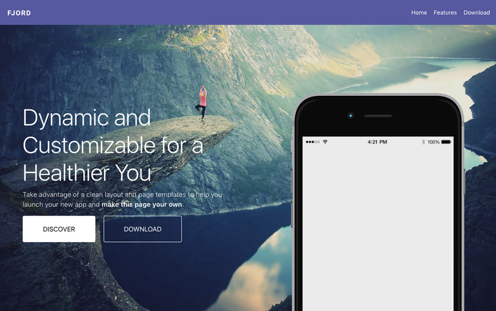
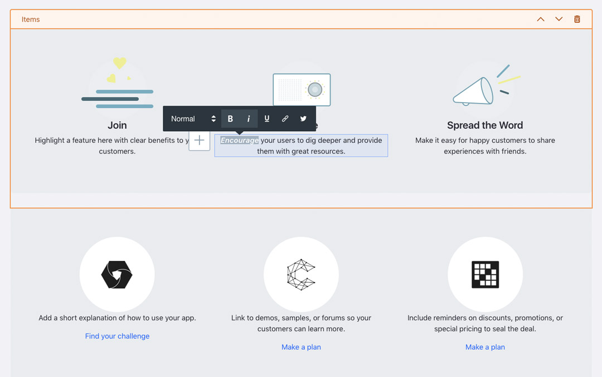

# Adding Custom Branding to the Liferay Platform

[$LIFERAY_LEARN_YOUTUBE_URL$]=https://www.youtube.com/embed/4Lb-N_uuiyc

One of the basic needs of any business is the need to control branding and design when developing different websites and apps to provide users with the best user experience. To start, each site needs its own branding, controlling things like logos, fonts, color schemes, etc., as well as the responsive framework. Brand control also includes page and content presentation and different JavaScript widgets and functionality. 

Front-end developers are familiar with a number of tool-sets and have experience with different languages and frameworks. Working with a platform that allows front-end developers to use the knowledge and skills they have will make for a much better development experience. Liferay's open development framework makes this possible. 


## Livingstone Hotels & Resorts 

Livingstone Hotels & Resorts is a premier hospitality company responsible for creating and maintaining a number of different sites for their hotels, resorts, and corporate employees. The web-team is responsible for implementing the branding and functionality needed to provide the ideal user experience for customers and employees. 

Natalia Michaels from Marketing and Martin Llewellyn from Design are responsible for working together to come up with mockups that will need to be implemented. These designs are used by the front-end team to create the theme, widgets, page, and page fragments. Kaito Tanaka and his team of web developers will be responsible for implementing these mockups. They normally use the following for their projects:
* NPM 
* Yeoman generators
* React
* Angular 

## Front-End Development on Liferay DXP

In order to customize the branding and presentation of the platform, developers have different options. These options give developers the ability to control the high-level experience as well as the specific content, widget, and component presentation.

```{important}
Key Point: <br>
<li>Liferay has three primary ways of creating stylistic changes on the platform:</li>
  <ul>
      <li>**Modules**: including Themes, Layout Templates, and JavaScript modules for global look-and-feel changes</li>
      <li>**Templates**: including specific customization options for content, assets, and widgets</li>
      <li>**Fragments**: including the ability to create the html, css, and JavaScript sections and components of any page</li>
    </ul>
```

## Themes and Layout Templates

Themes and Layout Templates are modules that give developers the ability to customize the global look-and-feel of a site as well as the layout of the pages with widgets on them. Themes are comprised of HTML, CSS, and JavaScript source files that control each page in a site as well as some site configuration options. Layouts are comprised of TPL source files and are based on the bootstrap grid system. Using both of these modules, developers have full control over the global branding and structure of their sites and pages.



## Web Content and Widget Display Templates

Once the global design and page structure has been created, developers can create templates on the platform that control the presentation of the different widgets and content on the site. 

Web Content is one of the primary assets on the platform for creating a variety of different types of content, such as static branding content, news articles, informational details, etc. Creating Web Content Templates allows developers to to provide the presentation of the content, allowing writers to get content out the door more quickly without having to worry over the formatting and design. 

Each page in a site can also contain a number of widgets that display different kinds of content and information within the layout of a site page. Templates can also be developed to align the presentation of these widgets with the rest of the branding customization. The following widgets can be customized with Widget Display Templates:
* Asset Publisher
* Blogs
* Breadcrumbs
* Categories Navigation
* Language
* Media Gallery
* Navigation Menu
* RSS Publisher
* Site Map
* Tags Navigation
* Wiki


## Page Fragments: Sections and Components

Finally, _Page Fragments_ will give the developers the tools they need to craft reusable page sections and components that can be used on pages along with other Assets or on _Content Pages_. Fragments can help bridge the gap between front-end developers and marketing/content teams responsible for creating and managing sites. These sections and components can be made editable by developers so that, once deployed, the content teams can edit them as needed to fit the use case and design of the site they're working on. Fragments can be created in two different ways:

1. On the platform, using the Page Fragment UI in Site Administration
2. Using the Liferay Fragments yeoman generator

```{important}
Key Point: <br>
<li>Creating Page Fragments using the Liferay Fragments generator is the best practice for treating your fragments like code within a DevOps lifecycle.</li>
  <ul>
    <li>You can find more information at [https://github.com/liferay/generator-liferay-fragments#liferay-fragments-cli](https://github.com/liferay/generator-liferay-fragments#liferay-fragments-cli)</li>    
  </ul>
```



## Knowledge Check

* Liferay has three primary ways of creating stylistic changes on the platform: ____________________, ____________________, and ____________________. 
* The front-end modules that provide global styling and page layout control are ____________________ and ____________________.
* Front-end templates include a number of options:
  * ____________________ Templates
  * ____________________ Templates
* ____________________ are reusable sections and components of a site page.

---

## Next Up

* [Front-End Development Frameworks](./front-end-development-frameworks.md)

## Previous Step

* [Front-End Development in Liferay](../front-end-dev-liferay.md)